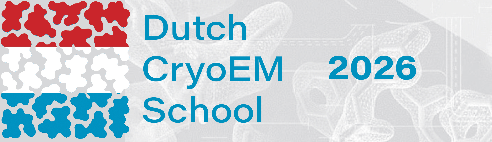
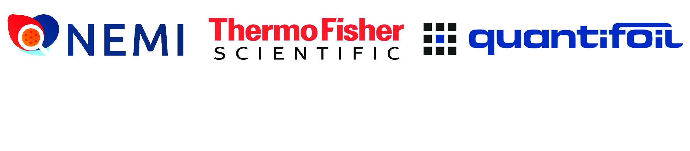

{width=900}

#
### About the course

The Dutch Cryo-EM School will take place from <b>29 June to 04 July 2026</b> in Leiden and Delft. The aim of this school is to teach the basic principles and practical aspects of image processing to structural and molecular biologists wishing to determine macromolecular structures by cryoEM. The course will cover all aspects of cryoEM structure determination, ranging from sample preparation over data collection to processing and interpretation of high-resolution image data, for both single particle images and tomograms, and will be aimed at advanced PhD students and postdocs using cryoEM for structural analysis.

### Invited speakers

 <ul>
  <li><a href="https://www2.mrc-lmb.cam.ac.uk/group-leaders/n-to-s/sjors-scheres/"><b>Sjors Scheres</b> (MRC-LMB, UK)</a></li>
  <li><a href="https://www.tudelft.nl/tnw/over-faculteit/afdelingen/imphys/about-the-department/mohammadi-gheidari-ali"><b>Ali Gheidari</b> (Delft University of Technology, NL)</a></li>
  <li><a href="https://www.biophys.mpg.de/molecular-sociology/turonova-beata"><b>Beata Turoňová</b> (Max Planck Institute of Biophysics, DE)</a></li>
  <li><a href="https://www.physik.uni-hamburg.de/personen/professoren/kaufmann-rainer.html"><b>Rainer Kaufmann</b> (University of Hamburg, DE)</a></li>
  <li><a href="https://www.uu.nl/staff/SCHowes"><b>Stuart Howes</b> (Utrecht University, NL)</a></li>
  <li><a href="https://www.ccpem.ac.uk/people/matt-iadanza/"><b>Matt Iadanza</b> (CCP-EM & UKRI-STFC, UK)</a></li>
  <li><a href="https://btoader.com/"><b>Bogdan Toader</b> (MRC-LMB, UK)</a></li>
  <li><a href="https://www.rc-harwell.ac.uk/who-we-are/group-leaders/tom-burnley"><b>Tom Burnley</b> (CCP-EM & UKRI-STFC, UK)</a></li>
  <li><a href="https://www.necen.nl/people/willem-noteborn-19"><b>Willem Noteborn</b> (NeCEN, NL)</a></li>
  <li><a href="https://www.linkedin.com/in/wim-hagen-6231123/?originalSubdomain=nl"><b>Wim Hagen</b> (Thermo Fisher Scientific, NL)</a></li>
  <li><a href="https://www.linkedin.com/in/oliver-raschdorf/"><b>Oliver Raschdorf</b> (Thermo Fisher Scientific, NL)</a></li>
<li><a href="https://www.ccpem.ac.uk/people/matt-iadanza/"><b>Matt Iadanza</b> (CCP-EM & UKRI-STFC, UK)</a></li>
  <li><a href="https://www.ccpem.ac.uk/people/rangana-warshamanage/"><b>Rangana Warshamanage</b> (CCP-EM & UKRI-STFC, UK)</a></li>
  <li><a href="https://www.ccpem.ac.uk/people/joel-greer/"><b>Joel Greer</b> (CCP-EM & UKRI-STFC, UK)</a></li>

</ul> 

!!! info "Applications and registration"
    <u>__Application__:</u>  
    The event is limited up to __20 participants__. 

    {==For selection purposes, please note that your application will not be considered without motivation==}. 
     
    
    During registration, please provide a brief motivation (max. 300 words) including a short description of your project, your level of prior experience with cryo-EM/ET and how you and your project will benefit from this school. You will also need to provide the name of your PI. Selected participants will be informed approximately 1-2 weeks after the application deadline on __01 April 2026__.   

    <u>__Registrations fees__:</u>  
    There are no registration fees for participants from academia. The program includes lunch/coffee on all course days, and the course dinner on Wednesday 01 July. Transportation to and from the venues, and accommodation, are not included in the school and need to be arranged by the participants.

---
#### Sponsored by

{height=100}
